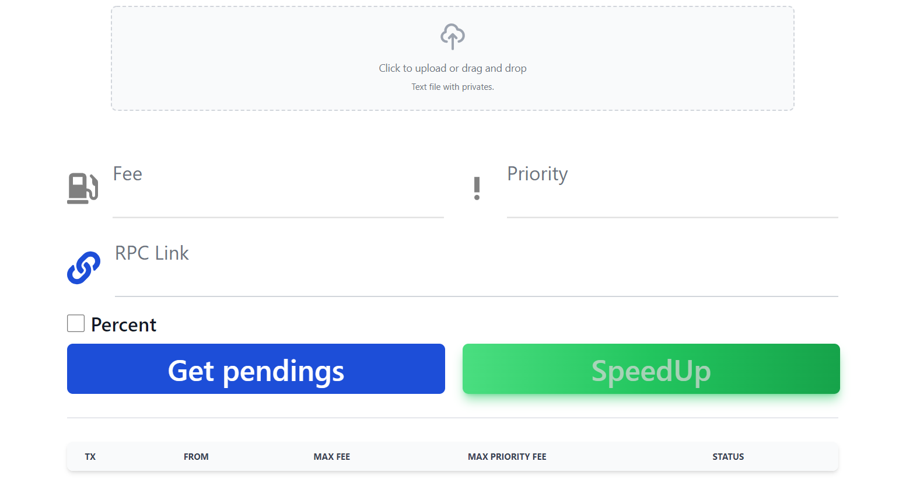

# Tx speedup

Program to speedup stuck transactions on the Ethereum chain.

# Release

Builded release for windows - https://github.com/typicalHuman/tx_speedup/releases/tag/v0.0.1

## Local setup

1. Install JS

2. Open the console and go to the folder containing the project, then type `npm install`.

3. After installation type `npm run start`.

## Guide:

1. Upload a text file containing the private keys for the accounts for which you want to speed up transactions. (each private key should be on a new line)

2. Specify desired fee and priority in GWEI

3. Specify RPC link for Ethereum, you can use any public one - [Ethereum Mainnet RPC and Chain Settings | ChainList](https://chainlist.org/chain/1)

4. Click `Get pendings` and if you have some stuck transactions - click `SpeedUp`.

5. You can also send transactions with percentage addition - specify `Percent` checkbox for this, *minimum value is 10*.

